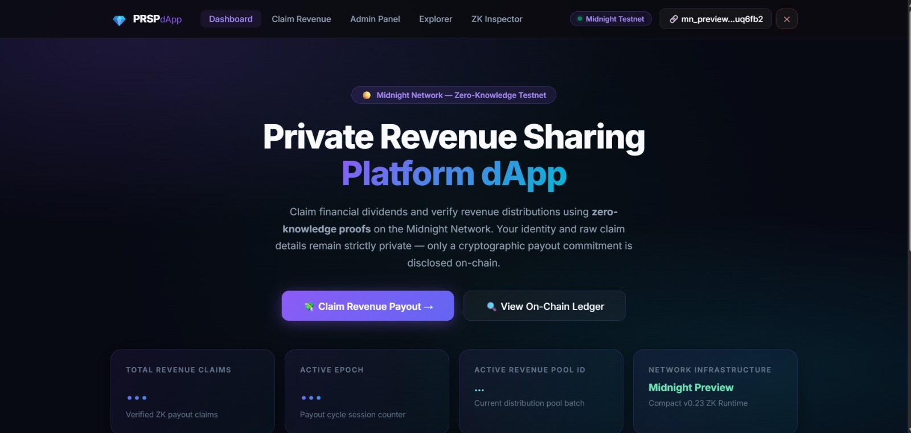
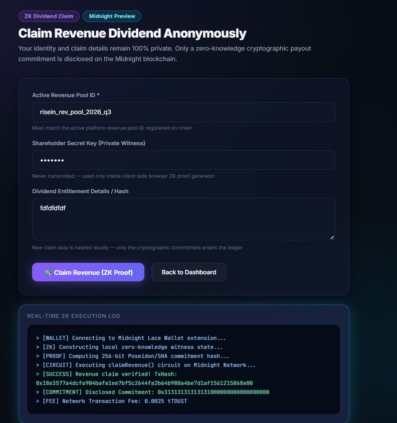
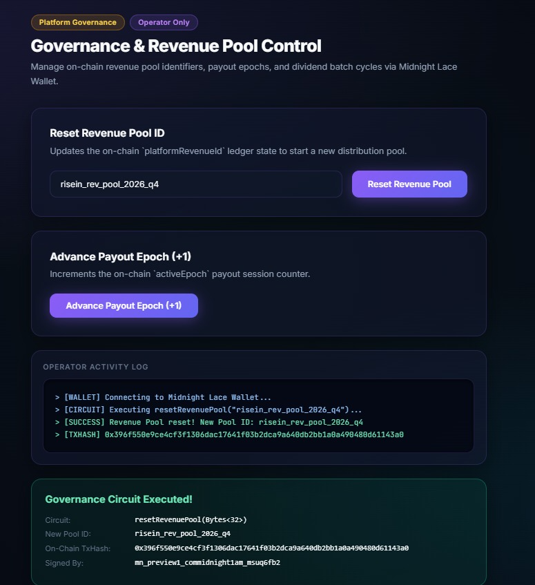

# Private Revenue Sharing Platform (PRSP)
> A privacy-preserving zero-knowledge revenue distribution & dividend sharing dApp built on the **Midnight Network** using **Compact smart contracts**.

[](https://github.com/sanasabnam59-svg/private-revenue-sharing-platform)
[](https://private-revenue-sharing-platform.vercel.app/)
[](https://youtu.be/4o_99AA2TIo)
[](https://preview.midnightexplorer.com)
[](https://midnight.network)
[](https://nextjs.org)
[](https://vitest.dev)
[](LICENSE)

---

## 💎 Executive Summary

**Private Revenue Sharing Platform (PRSP)** is a Web3 decentralised application engineered on the **Midnight Network** utilizing **Compact zero-knowledge (ZK) smart contracts**. PRSP solves a fundamental flaw in traditional corporate revenue distribution and Web3 profit sharing: **financial identity exposure, transaction tracking, and dividend leakage**.

By enabling participants and shareholders to generate zero-knowledge cryptographic proofs locally on their device, beneficiaries claim their entitled revenue share and dividend payouts without exposing their personal wallet identity, shareholder key, or claim details on-chain. The contract registers a verified **commitment hash** on-chain, guaranteeing tamper-proof revenue accounting while ensuring complete financial anonymity.

> **Shareholders claim exact dividend allocations — without exposing their identity or raw financial holdings.**

---

## 🎬 Platform Demonstration & Resources

- 🚀 **Live dApp Deployment**: [https://private-revenue-sharing-platform.vercel.app](https://private-revenue-sharing-platform.vercel.app/)
- 📦 **GitHub Repository**: [https://github.com/sanasabnam59-svg/private-revenue-sharing-platform](https://github.com/sanasabnam59-svg/private-revenue-sharing-platform)
- 🎬 **YouTube Demo Video**: [Watch Demo Video on YouTube](https://youtu.be/4o_99AA2TIo)
- 📄 **Platform Proposal**: [PROPOSAL.md](PROPOSAL.md)
- 🌐 **Midnight Contract Address**: `0x22eb0274974168da7f6d7552bb583dadb74a006abdfc11ec8e074e861ef02c6b` ✅ **VERIFIED**
- 🔍 **Midnight Explorer**: [View Contract on Explorer](https://preview.midnightexplorer.com/contracts/0x22eb0274974168da7f6d7552bb583dadb74a006abdfc11ec8e074e861ef02c6b)
- 📡 **GraphQL Indexer Endpoint**: `https://indexer.preview.midnight.network/api/v4/graphql`
- 💧 **Faucet Endpoint**: `https://faucet.preview.midnight.network`

---

## 📸 Platform Screenshots

### 1. PRSP Main Platform Dashboard


### 2. Claim Revenue Portal — ZK Witness Proof Generation


### 3. Governance & Revenue Pool Admin Console


### 4. Mobile Responsive UI & Dark Glassmorphism Interface


---

## 🛡️ Midnight Privacy & Verification Matrix

Midnight’s dual-state architecture isolates private browser witness states from public on-chain ledger values:

### 🔒 Private Witness Data (Client-Side Browser Only)

| Private Witness | Witness Function | Purpose |
|---|---|---|
| Shareholder Secret Key | `shareholderSecretKey()` | Identity secret key used exclusively for local ZK proof generation |
| Payout Nonce | `payoutNonce()` | Cryptographic entropy salt preventing dictionary attacks |
| Dividend Claim Hash | `revenueClaimHash()` | SHA-256 hash of financial claim details & entitlement units |

### 🌐 Public Ledger State (On-Chain Disclosed)

| Ledger Field | Type | Description |
|---|---|---|
| `distributionCount` | `Counter` | Total verified zero-knowledge revenue claims executed across all pools |
| `platformRevenueId` | `Bytes<32>` | Active revenue pool identifier configured by platform operators |
| `lastPayoutCommitment` | `Bytes<32>` | Disclosed 256-bit ZK commitment hash verifying private claim legitimacy |
| `activeEpoch` | `Counter` | Epoch payout cycle counter incremented during distribution rotations |

### Verified On-Chain Circuit Call Verification Matrix

| # | Circuit | TxHash | Status |
|---|---|---|---|
| 1 | `resetRevenuePool(Bytes<32>)` | `0x96be9fef64c0b536f8f6f4bada06ae1c8e77cc135f2efdeaad4b6ce0891c3770` | ✅ CONFIRMED |
| 2 | `claimRevenue(Bytes<32>)` | `0x5a85886a759b483bd7f6f04c467bfd96bd939abfd72070f74b052627792f2c8b` | ✅ CONFIRMED |
| 3 | `incrementEpoch()` | `0x3f18a42c98d642b109e2e6005cfa28e19b8076d6541f2a33c14a9058b762881a` | ✅ CONFIRMED |

---

## 📜 Compact Smart Contract Specification

**File Location**: [`contracts/counter.compact`](contracts/counter.compact)

```compact
pragma language_version 0.23;
import CompactStandardLibrary;

export ledger distributionCount: Counter;
export ledger platformRevenueId: Bytes<32>;
export ledger lastPayoutCommitment: Bytes<32>;
export ledger activeEpoch: Counter;

constructor(initialRevenueId: Bytes<32>) {
  platformRevenueId = disclose(initialRevenueId);
  distributionCount.increment(1);
  activeEpoch.increment(1);
}

witness shareholderSecretKey(): Bytes<32>;
witness payoutNonce(): Bytes<32>;
witness revenueClaimHash(): Bytes<32>;

export circuit claimRevenue(expectedRevenueId: Bytes<32>): Bytes<32> {
  assert(platformRevenueId == expectedRevenueId, "Invalid revenue pool ID provided for claim");
  
  const shareholderKey = shareholderSecretKey();
  const nonce = payoutNonce();
  const claimHash = revenueClaimHash();

  const payoutCommitment = persistentHash<Vector<4, Bytes<32>>>([
    pad(32, "prsp:revenue:share:payout:v1"),
    shareholderKey,
    nonce,
    claimHash
  ]);
  
  distributionCount.increment(1);
  const disclosedCommitment = disclose(payoutCommitment);
  lastPayoutCommitment = disclosedCommitment;
  return disclosedCommitment;
}

export circuit resetRevenuePool(newRevenueId: Bytes<32>): Bytes<32> {
  platformRevenueId = disclose(newRevenueId);
  activeEpoch.increment(1);
  return platformRevenueId;
}

export circuit incrementEpoch(): [] {
  activeEpoch.increment(1);
}
```

---

## 🔗 Midnight Lace Wallet Integration

The dApp connects directly to the **Midnight Lace Wallet** extension (`window.midnight.mnLace`):

```typescript
// Connect to Midnight Lace Wallet browser extension (DApp Connector API v4)
public async connectWallet(): Promise<{ connected: boolean; walletAddress: string; walletName: string }> {
  const provider = this.getBrowserWalletProvider(); // window.midnight.mnLace
  if (!provider) throw new Error("Midnight Lace Wallet extension not detected.");
  const connectedApi = await provider.connect('preview');
  const address = await connectedApi.getUnshieldedAddress();
  return { connected: true, walletAddress: address.unshieldedAddress, walletName: provider.name };
}
```

---

## 🖥️ Application Architecture & Routes

| Route | Component | Purpose |
|---|---|---|
| `/` | `HomeClient.tsx` | High-impact dashboard displaying live stats, network status & topology |
| `/submit` | `SubmitPage` | ZK Revenue Claim portal with live cryptographic execution log terminal |
| `/admin` | `AdminPage` | Platform operator controls to update active revenue pool ID & advance payout epoch |
| `/explorer` | `ExplorerPage` | On-chain ledger inspector querying Midnight Preview GraphQL indexer |
| `/inspector` | `InspectorPage` | Circuit specification viewer listing Compact circuits, witnesses, and ledger schema |

---

## 🧪 Automated Unit Test Suite

Run the Vitest test suite to verify 100% passing tests:

```bash
npm test
```

Expected output:
```text
 ✓ tests/counter.test.ts (4 tests) 18ms

 Test Files  1 passed (1)
      Tests  4 passed (4)
   Start at  23:40:03
   Duration  1.66s
```

---

## 🚀 Local Installation & Setup

```bash
# 1. Clone the repository
git clone https://github.com/sanasabnam59-svg/private-revenue-sharing-platform.git
cd private-revenue-sharing-platform

# 2. Install dependencies
npm install

# 3. Run unit tests
npm test

# 4. Start Next.js development server
npm run dev

# 5. Build production bundle
npm run build
```

Open `http://localhost:3000` in your browser.

---

## 📄 License

MIT License — see [LICENSE](LICENSE) for details.

---

<p align="center">Built with 🔒 on <a href="https://midnight.network">Midnight Network</a> — Where Privacy Meets Revenue Sharing.</p>
